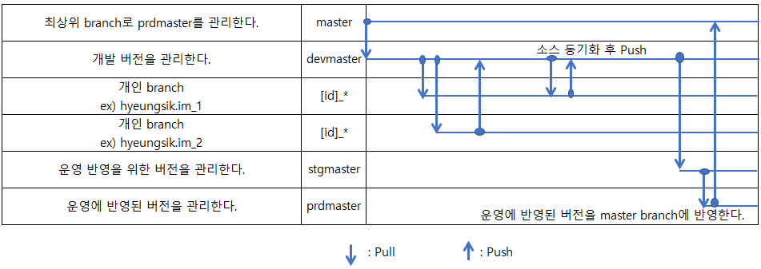
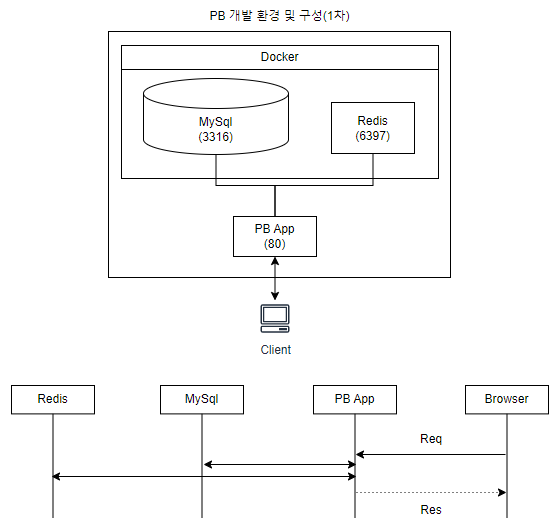
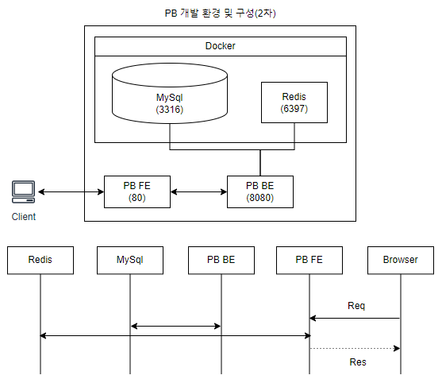

# PB(Practical_Backend) Project

- PB 개발 개발시 branch 사용 방법은 아래 < 그림 1: PB Branch 전략 >과 같은 흐름을 참고하세요.

|  |
|:---------------------------------------------------------------------------------:|
|                      < 그림 1 : PB Branch 전략 >                                   |

- 1차 개발 환경 및 구성은 아래 < 그림 2 : 1차 개발 환경 및 구성 >과 같습니다.

>|  |
>|:---------------------------------------------------------------------------------:|
>|                             < 그림 2 : 1차 개발 환경 및 구성 >                        |
> 개발 환경은 아래 "1. 개발환경 및 설정"을 참고하세요.
1차 개발 구성을 완성한 후에 PB 구조를 Pront/Back-End로 개선하는 과정으로 넘어 갈 예정입니다.

- 2차 개발 환경 및 구성은 아래 < 그림 3 : 2차 개발 환경 및 구성 >과 같습니다.

|  |
|:---------------------------------------------------------------------------------:|
|                              < 그림 3 : 2차 개발 환경 및 구성 >                       |

---

# [1. 개발환경 및 설정](./doc/wiki/devEnv/dev-env.md)

# 2. PB 프로젝트 구조 및 package

