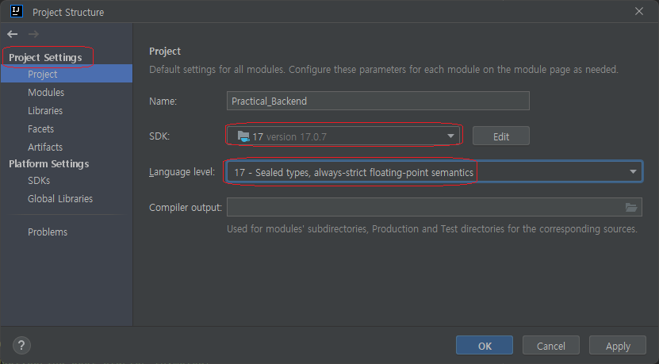
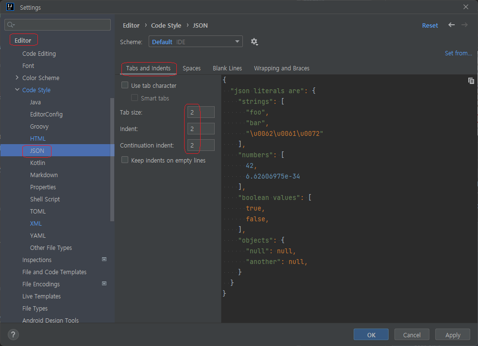

# 1.1. Intellij 환경 설정

본 프로젝트에서 사용하는 IDE로 Intellij community를 사용할 것이므로 여기(https://www.jetbrains.com/ko-kr/idea/download/)에서 다운받아 설치한다.

## 1.1.1. Project Settings

- `Menu > File > Project Structure`에서 SDK 버전을 설정한다.
>|  |
>|:-----------------------------------------------------------------------------------------------:|
>|                        < 그림 1.1.1.-1 : Project Settings - SDK version >                         |
>- SDK : 17
>
>- Language level : 17 - Sealed types, always-strict floating-point semantics

- `Menu > File > Settings`에서 Gradle환경을 설정한다.
  
  본 프로젝트는 Gradle을 사용하기 때문에 Gradle 환경 설정을 아래 그림과 같이 설정한다.

>|  |
>|:---------------------------------------------------------------------------------------------:|
>|                                  < 그림 1.1.1-2 : Gradle 설정 >                                   |
>- Gradle user home : gradle home 디렉토리를 설정한다.
>
>- Gradle JVM : 설치한 java를 선택한다(Ver 17).

- `Menu > File > Settings`에서 아래 그림과 같이 Java Compiler를 설정한다.

>|  |
>|:-------------------------------------------------------------------------------------------:|
>|                              < 그림 1.1.1-3 : Java Compiler 설정 >                              |
>- Project bytecode version : 17(설치한 Java Version)

- java vm 한글 설정을 위해 아래의 파일(*.vmoptions)을 수정한다.
  
  ex) C:\Users\임흥식\AppData\Local\JetBrains\Toolbox\apps\IDEA-C\ch-0\231.8770.65.vmoptions

>|  |
>|:---------------------------------------------------------------------------------------:|
>|                         < 그림 1.1.1-4 : Intellij java vm 한글 설정 >                         |

- `Menu > File > Settings`에서 아래 그림과 같이 `File Encodings` 를 설정한다.

>|  |
>|:----------------------------------------------------------------------------------------------------:|
>|                              < 그림 1.1.1-5 : File Encoding 설정 - UTF-8 >                               |
>- Global Encoding : UTF-8
>- Project Encoding : UTF-8
>- Default encoding for properties files : UTF-8

### 1.1.2. Project Code Style
HSTT project는 아래와 같이 최소한의 code style 환경을 설정함으로써, 
서로다른 구성원이 동일한 소스를 수정하여도 기본적인 포맷이 유지될 수 있도록 한다.

- Code Style - Java
>|  |
>|:--------------------------------------------------------------------------------------------------------------:|
>|                                     < 그림 1.1.2-1 : Java - Tabs & Indents >                                     |

- Code Style - HTML
>|  |
>|:--------------------------------------------------------------------------------------------------------------:|
>|                                     < 그림 1.1.2-2 : HTML - Tabs & Indents >                                     |

- Code Style - JSON
>|  |
>|:--------------------------------------------------------------------------------------------------------------:|
>|                                     < 그림 1.1.2-3 : JSON - Tabs & Indents >                                     |

- Code Style - XML
>|  |
>|:-------------------------------------------------------------------------------------------------------------:|
>|                                     < 그림 1.1.2-4 : XML - Tabs & Indents >                                     |

- Code Style - YML
>|  |
>|:--------------------------------------------------------------------------------------------------------------:|
>|                                     < 그림 1.1.2-5 : YML - Tabs & Indents >                                      |

- Code Style - Other File Types
>|  |
>|:---------------------------------------------------------------------------------------------------------------:|
>|                               < 그림 1.1.2-6 : Other File Types - Tabs & Indents >                                |

