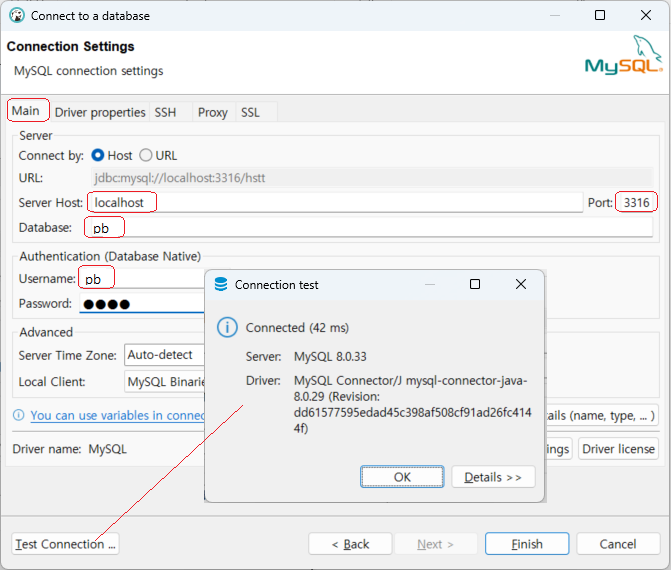

## 1.2.2. Docker - MySQL 설치 및 연결
### 1.2.2.1. MySql 설치 
MySQL 컨테이너 디렉토리 구조

|  |
|:---------------------------------------------------------------------------------------------:|
|                              < 그림 1.2.2-1 : MySQL 컨테이너 디렉토리 구조 >                              |

디렉토리 구성과 용도는 아래와 같습다.

- docker-compose.yml

  mysql image를 이용하여 hstt container를 생성합니다.

- hstt

  hstt DB container와 관련된 데이터 저장소

    - db : hstt DB의 데이터 저장소
    - mysql-config-files/my.cnf : hstt DB container를 만들때의 설정 파일
    - mysql-init-files/create.sql : hstt DB container를 만들때 DB 생성, 권한 설정등을 하는 파일


- [docker-compose.yml](../../산출물/docker-yml/mysql/docker-compose.yml)

```
# docker-compose.yml
version: '3.9'

services:
  # 서비스명
  mysql:
    # 사용할 이미지
    image: "mysql:8.0.33"
    container_name: mysql
    # 컨테이너 실행 시 재시작
    restart: always
    # 환경 변수 설정
    environment:
      MYSQL_ROOT_PASSWORD: 1111
      TZ: 'Asia/Seoul'
      # 접근 포트 설정(컨테이너 외부:컨테이너 내부)
    ports:
      - '3316:3306'
    expose:
      - '3316'
      # 명령어 설정
    command:
      - --character-set-server=utf8mb4
      - --collation-server=utf8mb4_unicode_ci
    # 볼륨 설정
    volumes:
      # {연결될 실제 물리 folder path}:{docker 안의 folder path}
      - './db:/var/lib/mysql'
      # hstt db 초기화
      - './mysql-init-files:/docker-entrypoint-initdb.d/'
      # mysql configuration 정보
      - './mysql-config-files:/etc/mysql/conf.d'
```

services 내에 서비스 이름으로 mysql를 지정한다.

- image는 mysql이고 8.0.33 버전을 사용
- volums
  - `./db:/var/lib/mysql`는 각종 log와 index등이 volume이 저장되는 디렉토리 설정
- volumes
  - `./mysql-config-files:/etc/mysql/conf.d`는 DB container를 만들때의 설정 파일(my.cnf)
- volumes
  - `./atp/master/mysql-init-files/:/docker-entrypoint-initdb.d/`는 DB 생성 및 권한 설정등을 하는 파일
- ports 

  이 옵션은 container 외부와 내부의 포트맵핑을 수동으로 설정할 수 있도록 해줍니다. 

MySQL 컨테이너 디렉토리(docker-compose.yml)에서 `docker-compose up -d` 명령으로 container를 실행 시킨다.


#### 1.2.2.2. MySQL 접속

핸드사인톡톡 서비스 개발시 MySQL를 사용하며, local DB 접속 정보는 아래와 같다.

MySQL Client 도구로 DBeaver를 사용하는 것을 전제로 문서를 작성하였다. DBeaver를 설치 후 아래의 정보를 참고하여 DB에 접속한다.

```
• host : localhost
• 포트 : 3316
• DataBase : pb
• id : pb
• pw : 1111
```

- 아래 그림과 같이 DBeaver의 `메뉴 > 데이터베이스 > 새 데이터베이스연결`에서 MySQL을 선택한다.

|  |
|:-------------------------------------------------------------------------------------------:|
|                        < 그림 1.2.2-2 : DBeaver mysql DB 연결 설정 화면 1 >                         |

- MySQL DB에 접속하기 위해 아래와 같은 정보를 입력하고 `Test Connection` 버튼을 선택해 DB에 접속되는지 확인 한다.

|  |
|:----------------------------------------------------------------------------------------------:|
|                          < 그림 1.2.2-3 : DBeaver mysql DB 연결 설정 화면 2>                           |


|  |
|:------------------------------------------------------------------------------------------------:|
|                           < 그림 1.2.2-4 : DBeaver mysql DB 연결 설정 화면 3 >                           |
- 개발 DB 서버에 접속된 화면은 아래와 같다.

|  |
|:-------------------------------------------------------------------------------------:|
|                     < 그림 1.2.2-5 : DBeaver mysql DB 연결 설정 화면 4 >                      |
