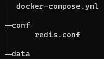

## 1.2.3. Docker - Redis 설치
### 1.2.3.1. Redis 설치
Redis 컨테이너 디렉토리 구조

|  |
|:---------------------------------------------------------------------------------------------:|
|                               < 그림 1.2-1 : Redis 컨테이너 디렉토리 구조 >                               |

디렉토리 구성과 용도는 아래와 같습다.

- docker-compose.yml

  redis image를 이용하여 redis container를 생성합니다.

- redis

  redis container와 관련된 데이터 저장소

    - data : redis의 데이터 저장소
    - conf/redis.conf : redis container를 만들때의 설정 파일


- [docker-compose.yml](../../산출물/docker-yml/redis/docker-compose.yml)

```
# docker-compose.yml
version: '3.9'

services:
  # 서비스명
  redis:
    # 사용할 이미지
    image: "redis:latest"
    container_name: redis
    # 컨테이너 실행 시 재시작
    restart: always
    # 접근 포트 설정(컨테이너 외부:컨테이너 내부)
    ports:
      - '6379:6379'
    expose:
      - '6379'
    labels:
      - "name=redis"
      - "mode=standalone"
    # 볼륨 설정
    volumes:
      - './data:/data'
      - './conf/redis.conf:/usr/local/conf/redis.conf'
      
    # 명령어 설정
    command: redis-server /usr/local/conf/redis.conf
```

services 내에 서비스 이름으로 redis 지정한다.

- image는 redis이고 최신 버전을 사용
- volums
  - `./data:/data`는 데이터들이 저장되는 디렉토리 설정
- volumes
  - `./conf/redis.conf:/usr/local/conf/redis.conf`는 redis container를 만들때의 설정 파일
- ports 

  이 옵션은 container 외부와 내부의 포트맵핑을 수동으로 설정할 수 있도록 해줍니다. 

Redis 컨테이너 디렉토리(docker-compose.yml)에서 `docker-compose up -d` 명령으로 container를 실행 시킨다.
